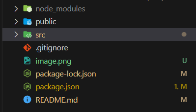
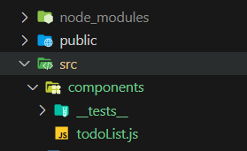
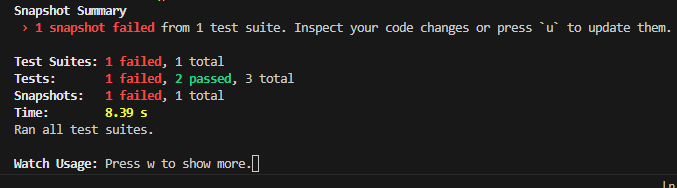
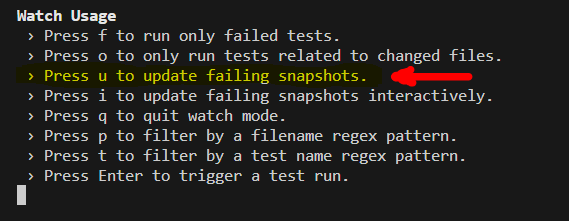
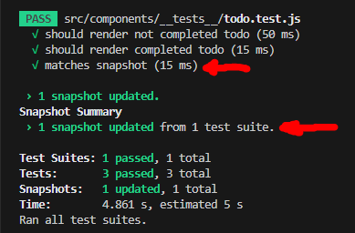

# Article
# Jest testing for React Crash Course
Hi! everyone! ✋😄 

My name is Obed and  I'm quite new in software engineering. This will be the very first article I write as a software engineer and also as a member of this community.🥳🥳

I am just so excited!🚀😅

Okay Let's dive right into it. Today we will learn about jest a popular react testing framework.

In a test-driven environment, the process of development is that you write test before writing the code and Jest is one powerful tool to have under your sleeve as a react developer for testing your components. This proactive approach, ensures that your code meets requirements and functions correctly, enhancing software reliability and the overall software efficiency.

If you're new to coding or testing, fear not - this article wil be your friendly guide. Whether you are a curious coder or just a tech enthusiast, this simple steps will introduce you TDD(Test driven development) and teach you how to use Jest for testing with confidence. Let's jump in and learn how to build awesome React apps together!

Shall we...🚀🚀


## Creating our React Application

- First what we will do open vscode and in the terminal we create a new folder on our desktop called "**react-testing-with-jest**" and move to it as so

  `mkdir react-testing-with-jest; cd react-testing-with-jest; code .`

- next we'll type the following into the command line.  

  `npx create-react-app ./` to create a new react application with the name "**react-testing-with-jest**" 
- This will be our folder structure:
  
  


## Installing required dependencies
- The only dependency we are going to install will be "react-test-runner" and "@testing-library/react". Type the following into the command line: 
  
  `npm i --save-dev @testing-library/react react-test-renderer`

  by doing this we install "@testing-library/react" and "react-test-renderer" ***devDependencies*** as such in our package.json folder
  ```json
  {
	there are other properties here
	-------------------------------
  	"devDependencies": {
        "@testing-library/react": "^14.0.0",
        "react-test-renderer": "^18.2.0"
      }
  }
  ```
- Next add the `--watchAll` flag to your "***test***" field inside the script field:
  ```json
    {
		there are other properties here
		-------------------------------
		"scripts": {
          "start": "react-scripts start",
          "build": "react-scripts build",
          "test": "react-scripts test --watchAll", //Here
          "eject": "react-scripts eject"
        },
		-------------------------------
		there are other properties here
   }
  ```

## Setting up folder structure and file content
- Open the **App.js** file in the ***src*** folder and type the following into the folder: 
  ```javascript
    import React from "react";

    function App() {
      return (
        <div className="App"></div>
      );
    }

    export default App;
  ```

- Now we create a new folder called ***components*** folder  within the ***src*** and within the ***components*** folder we create a folder called ***\_\_tests__*** and a file called ***todoList.js*** as follows: 

  
  

- Inside ***todoList.js*** type the following: 
  ```javascript
    
	import React from "react";

    function TodoList(){
    	return ();
    };


    export default TodoList;
  ```

## Now Lets start Writing Some tests 🚀🚀💪
- Within the ***\_\_tests__*** folder create a file called **todo.test.js**.
- Inside todo.test.js type the following code: 
  
  ```javascript
    import {render, screen, cleanup} from '@testing-library/react';
    import renderer from 'react-test-renderer';
    import TodoList from '../todoList';

    afterEach(()=>{
    	cleanup();
    });

    test('should render not completed todo', ()=>{
    	const todo = {id: 1, title: 'wash dishes 🍽🍽', complteted: false,};

    	//We render a simulated version of the react component
    	render(<TodoList todo={todo} />);

    	//get the value of the testId stored on the Todo component
    	const todoElement = screen.getByTestId('todo-1');

    	//get a child within the testId with the class mytodo
    	const childElement1 = todoElement.querySelector('.mytodo');


    	//We test todoElement and childElement1 to see whether their in the DOM

    	expect(todoElement).toBeInTheDocument(); //Passes if the Todo component is present in the DOM

    	expect(childElement1).toBeInTheDocument(); //passes if the .myTodo is present in the DOM

    	//checks 'wash dishes' is in todoElement
    	expect(todoElement).toHaveTextContent('wash dishes');

    	//checks #todo is an attribute
    	expect(childElement1).toHaveAttribute('id', 'todo');
    });
  ```
  ### Code Explanation 📔: 
  - #### Our Imports:
    -  In the above code we are importing *render*, *screen*, *cleanup* from *@testing-library/react*
    -  We also import *renderer* from *react-test-renderer* this will be used for creating **snapshot**. I will explain what snapshots are later
    -  And finally we import our TodoList component from the todoList.js file.


  - #### The `afterEach()` function call:
    - we use the `afterEach()` function call to perform an action after each test. In this case we are clearing the testing console by passing a callback function as argument to `afterEach()` and calling the `cleanup()` function.
  - #### Creating Test:
    - How do we create tests? It is as simple as typing the function call `test()`.
    - `test()` takes two arguments. the first is a string which desribes what you as the developer is testing for the next argument is a callback function. Inside it is where your assertions are made to pass the tests.
    - The `todo` variable is a prop we specify which will be passed to the `<TodoList />` component specially for testing purposes.
    - Using the `render()` method we create an instance of the `TodoList` component parsing the content of the todo variable as props to the TodoList with the prop name `todo`.
    - `todoElement` variable gets the DOM element with the testid `todo-1`
    - We create `childElement1` variable which gets a child element nested within the `todoElement` with the class `.mytodo` by chaining a `querySelector()` with `.mytodo` passed as argument.
    - ##### The `expect()` api:
      The `expect()` api is chained with other methods called matchers for running assertions.
	  - For example `expect(todoElement).toBeInTheDocument()` checks whether the component with the testId `todo-1` is in the document. If this is true the test passes for this particular assertion.
	  - This is the same for the next `expect()` api.
    	Just Like the `.toBeInTheDocument()` chained method, there are other methods like `.toHaveTextContent()` which checks whether the text content passed to the method is within the component or jsx. Also there are other methods like `.toHaveAttribute()` which takes two arguments "an attribute as the first" and "its the value" as the second.
	> For More Information about Jest matchers checkout the [Jest Documentation](https://jestjs.io/docs/using-matchers)

## Writing the rest of the tests code
```javascript
  test('should render completed todo', ()=>{
  	const todo = {id: 2, title: 'wash car', completed:true};

  	render(<TodoList todo={todo} />);
  	const todoElement = screen.getByTestId('todo-2');

  	expect(todoElement).toBeInTheDocument();
  	expect(todoElement).not.toContainHTML('<strike>');
  	expect(todoElement).toHaveTextContent('wash car');
  });

  test('matches snapshot', ()=>{
  	const todo = {id: 1, title: 'wash dishes', completed: false,};

  	const tree = renderer.create(<TodoList todo={todo} />).toJSON();
  	expect(tree).toMatchSnapshot();
  }); 
```
### Code Explanation for the last test 📔:
- ### `test('matches snapshot', ()=>{...})`:
	- Remember we imported some renderer method from  react-test-renderer. Yeah! this is where it is put to use.
	- It is used to get the DOM elements and its properties in the form of JSON by chaining it with create() method which takes in the TodoList component as argument and we chain the method toJSON() which converts everything to JSON. The value is then stored in tree.
	- We make an assertion by creating a snap shot with the line `expect(tree).toMatchSnapshot()`.
    	- A snapshot is a way to capture a rendered component's output and save it as a serialized representation of the component's structure and content. This snapshot serves as a baseline to compare against in subsequent test runs. unintended changes in your component's output, which could result from code changes.The snapShot is stored in a folder called ***\_\_snapshots__*** inside a file called ***todo.test.js.snap***.
    	- To Run the test type `npm test` in the new console. Initially all the tests will fail except for the snapshot part.

## Back to our application
Now we are ready to write code to pass our test. 


- ###App.js:
  - Open the App.js file and complete the code by typing the following:
    ```javascript 
      	import React from "react";
        import TodoList from "./components/todoList";


        function App() {
        	const todos = [
        		{id: 1, title: 'wash dishes', completed: false,},
        		{id: 2, title: 'make dinner', completed: true,},
        		{id: 3, title: 'wash dishes', completed: false,},
        	];
          return (
            <div className="App" data-testid="myApp">
        		{
        			todos.map((todo)=>(<TodoList todo={todo} />))
        		}
            </div>
          );
        }

        export default App;
	```
  - #### Code Explanation: 
    - We are creating an array of objects and assigning it to the variable todos.
    - Inside our return function we nest the `div` jsx with a line of code to map over the objects stored in todos and pass each element as prop to `TodoList` component.
- ### todoList.js:
  - Open the **todoList.js** file and complete the code by typing the following:
   ```javascript
     function TodoList({todo}){
    	const {id, title, completed} = todo;
    	const h1 = <h1 className="mytodo">{title}</h1>;
    	const text = completed ? <strike>{h1}</strike> : h1;

      	return (
      		<div id="todo" data-testid={`todo-${id}`}>
      			{text}
      		</div>
      	);
      };


      export default TodoList;
   ```
	 - #### Code Explanation:
    	 - The first line inside the TodoList component gets the fields in the "todo" prop.
    	 - We wrap the title variable around an h1 tag with a className of 'mytodo' and store it in an h1 variable.
    	 - On the next line we check if is completed is true we store the 'h1' variable wrapped in a strike tag to the text variable else we just store the original 'h1' variable to the `text` variable.
    	 - Inside our return statement we create a div tag with the attributes `id="todo"` and `data-testid={'todo-${id}'}` and nest the `text` variable within it.
    	 - Now when we save our code and rerun our test with `npm test`, we get every other test passing but the snapshot failing. This is because, the jsx within the TodoList has changed as such the snapshot doesn't match the TodoList component's jsx. So this is what we get in our console:
        
          
        
		  As you can see we have two of our test passing and one failing and this one is the snapshot. We can reset the snapshot by pressing "w to show more options".

		  

    		To solve this problem we press "u" to update our snapshot.

		

			So as you can see our snapshot has been updated and all our tests pass now.

			The final folder structure should look something like this:

			


So there you have it "Jest testing for React crash course" step by step tutorial. Thanks for your time guys. I am opened to reply to any comments. So feel free to! 😎

> Get the code for [this project](https://github.com/obedNuertey1/react-testing-with-jest.git)

---
---


# Technical Documentation Main For JEST testing

## Folder structure

## Other installs

- Using snapShots
- run `npm i --save-dev @testing-library/react react-test-renderer`
- and import the following to start creating your tests
```js
  import {render, screen, cleanup} from '@testing-library/react';
  import renderer from 'react-test-renderer';
```
## Run Tests with `npm test`
## Run React up with `npm start`
